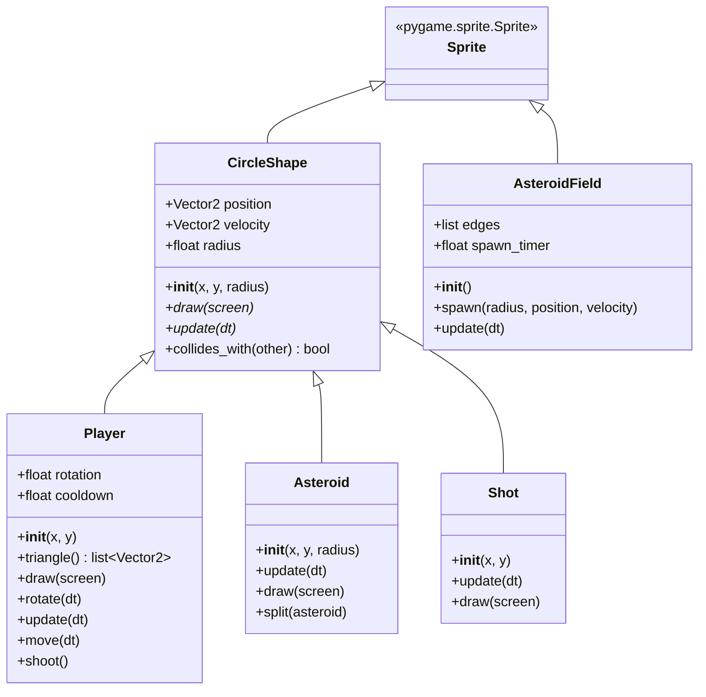

# Asteroids Architecture

This document provides a high-level overview of the architectural structure of the Asteroids project.

## Class Diagram

The project is built using Python and Pygame, following an object-oriented approach. Below is a Mermaid class diagram illustrating the relationships between the main classes:

## System Overview

1. **Game Loop (`main.py`)**: 
   - Handles the initialization of Pygame.
   - Manages Pygame sprite groups (`updatable`, `drawable`, `asteroids`, `shots`) for efficient updating and rendering of game objects.
   - Contains the main loop which processes events, updates positions (via `dt`), detects collisions, and draws the frame.

2. **Base Shape (`circleshape.py`)**:
   - `CircleShape` extends `pygame.sprite.Sprite` and acts as a base class for all collidable physical objects in the game.
   - It provides `position`, `velocity`, `radius`, and a base `collides_with` method for circle-based collision detection.

3. **Game Entities**:
   - **`Player` (`player.py`)**: Extends `CircleShape`. Manages player inputs, rotation, movement, and shooting. It contains a cooldown timer to limit shooting frequency.
   - **`Asteroid` (`asteroid.py`)**: Extends `CircleShape`. Represents asteroids of various sizes. Handles moving and splitting into two smaller asteroids upon being hit.
   - **`Shot` (`shot.py`)**: Extends `CircleShape`. Represents projectiles fired by the player.

4. **Managers**:
   - **`AsteroidField` (`asteroidfield.py`)**: Extends `pygame.sprite.Sprite`. Manages the timed spawning of asteroids at the edges of the screen, launching them inwards at random angles and speeds.

5. **Utilities**:
   - **`constants.py`**: Holds game configuration constants like screen dimensions, speeds, and sizes.
   - **`logger.py`**: Handles event and state logging.
